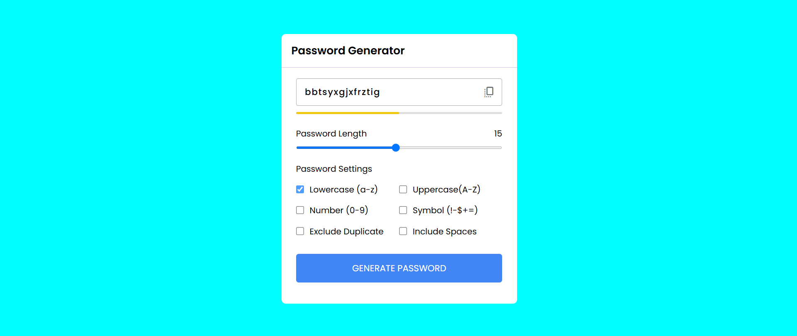

#  Weather App

## Table of contents

- [Overview](#overview)
  - [Screenshot](#screenshot)
  - [Links](#links)
  - [Built with](#built-with)
  - [Description](#Description)
  - [Useful resources](#useful-resources)
- [Author](#author)

## Overview

This webpage displays a Password Generator App designed using HTML, CSS, and JavaScript. It features a clean, modern layout with a minimalistic style and a focus on responsive design.

## Screenshot

## Links

- Live Site URL: [Live](https://versatile28.github.io/Password_generator/)

## Built with

- Semantic HTML5 markup
- CSS basic properties
- Flexbox
- JavaScript

## Description

The Password Generator App allows users to create secure, random passwords based on customizable options. Users can specify criteria such as the length of the password and the inclusion of uppercase letters, lowercase letters, numbers, and special characters. Designed to enhance user security, this app is both functional and aesthetically pleasing, with responsive design ensuring compatibility across various devices.

### Features:

- Customizable Options: Users can select password length and toggle the inclusion of different character types.
- Real-Time Password Generation: Instantly generates secure passwords as per user specifications.
- Copy to Clipboard: Provides an option to copy the generated password for convenience.
- Error Handling: Displays appropriate messages if user inputs are invalid or unsupported.
- Responsive Design: Adapts seamlessly to different screen sizes for an optimal user experience.

## Useful resources

- [MDN Web Docs](https://developer.mozilla.org/en-US/) - Every HTML and CSS properties and their details are available here.It helped me to learn about different properties from here.
- [CSS Tricks](https://css-tricks.com/) - An excellent site for learning about CSS, including tips, tricks, and best practices.

## Author

- Website - [Satyaki Pal](www.linkedin.com/in/sp2812)
